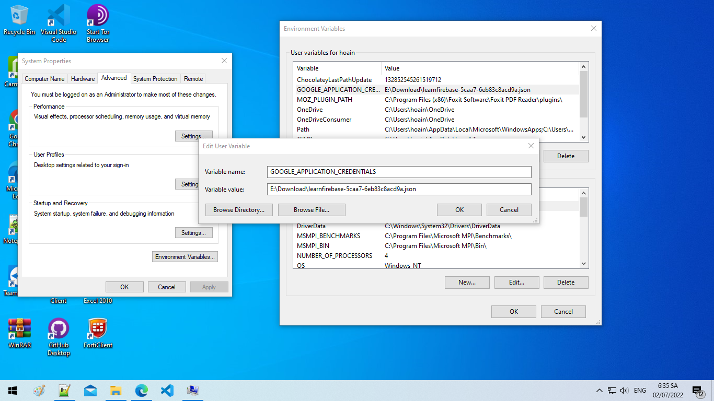
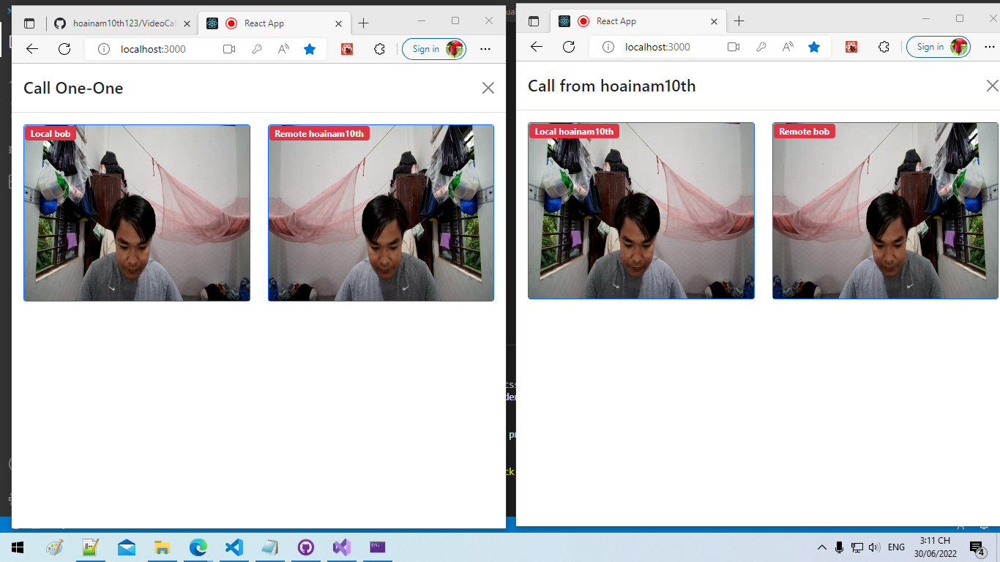
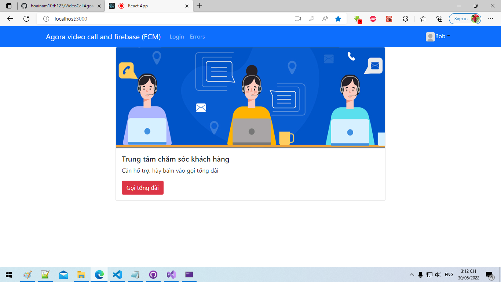
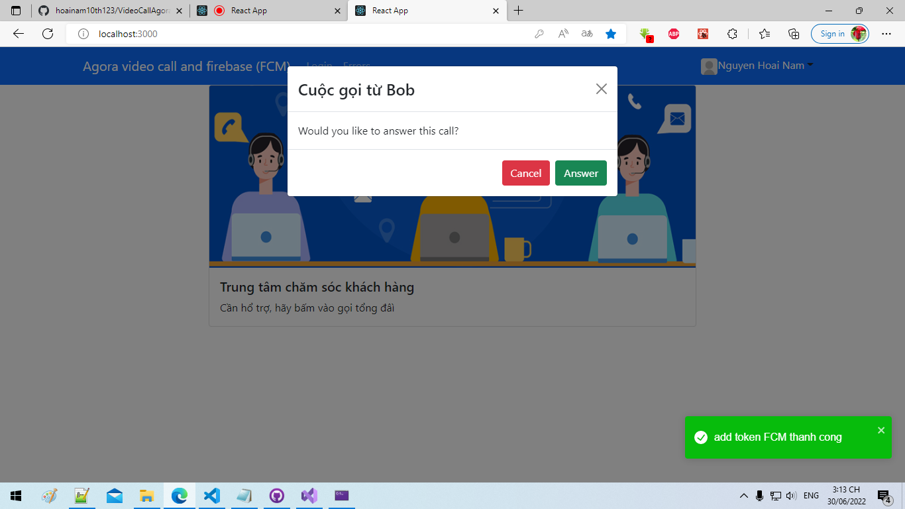
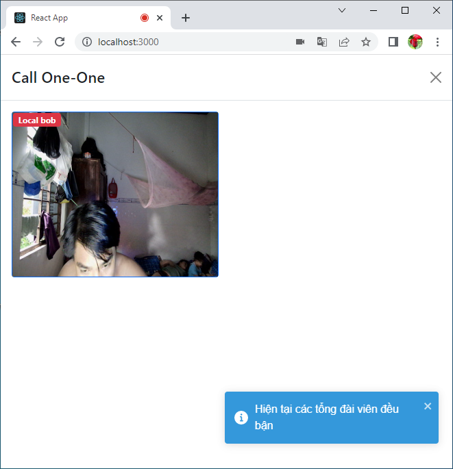

# Video Call AgoraSdk, Firebase (.Net 6 & React 18)
# Cấu hình firebase
<ol>
  <li>Project settings/Cloud Messaging: Cloud Messaging API (Legacy)  Enabled
bật Cloud Messaging API thì app server mới gửi message đi được.</li>
  <li>Làm theo các bước sau To generate a private key file for your service account: https://firebase.google.com/docs/admin/setup</li>
  <li>Sau khi generate a private key file thì Tạo biến môi trường **GOOGLE_APPLICATION_CREDENTIALS** trỏ đường dẫn đến file mà firebase vừa tạo như hình dưới, sau đó log out và login lại để nhận biến vừa tạo</li>
  <li>Xong cấu hình, chạy thôi, khá là phức tạp đúng không</li>
</ol>

# Video call 1-1, agora SDK, Firebase (FCM)
## 1 FE (React 18):
<ol>
  <li>Mobx for state managment</li>
  <li>Bootstrap UI</li>
  <li>Axios call API</li>
  <li>Firebase (FCM) for notifications</li>
  <li>formik</li>
  <li>react-router v6</li>
  <li>rxjs</li>
  <li>typescript</li>
</ol>

## 2 BE (.Net 6)
<ol>
  <li>Code first, EF Core migrations</li>
  <li>Web API</li>
  <li>UnitOfWork</li>
  <li>Identity</li>
  <li>Sql server database</li>
  <li>Firebase Admin</li>
</ol>

